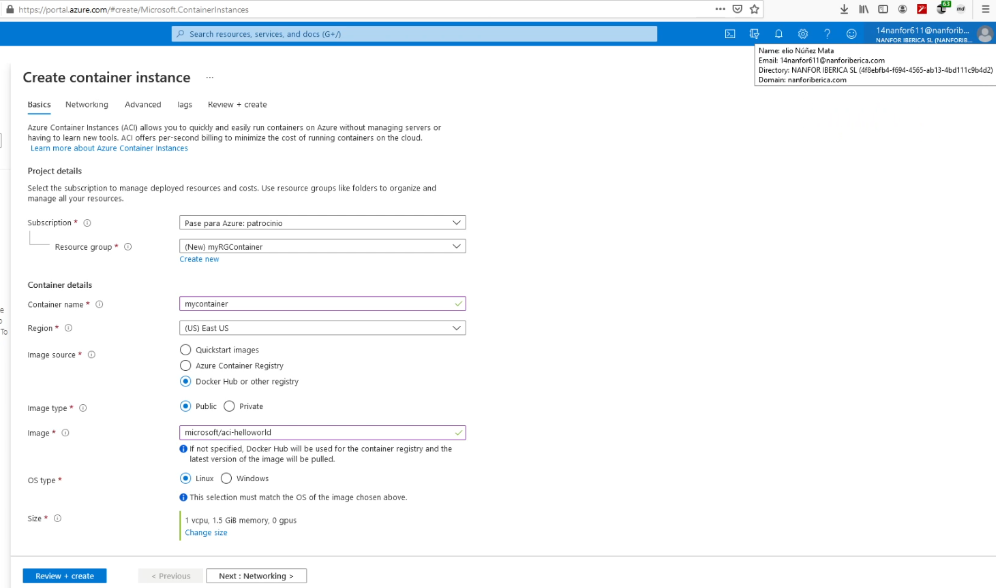
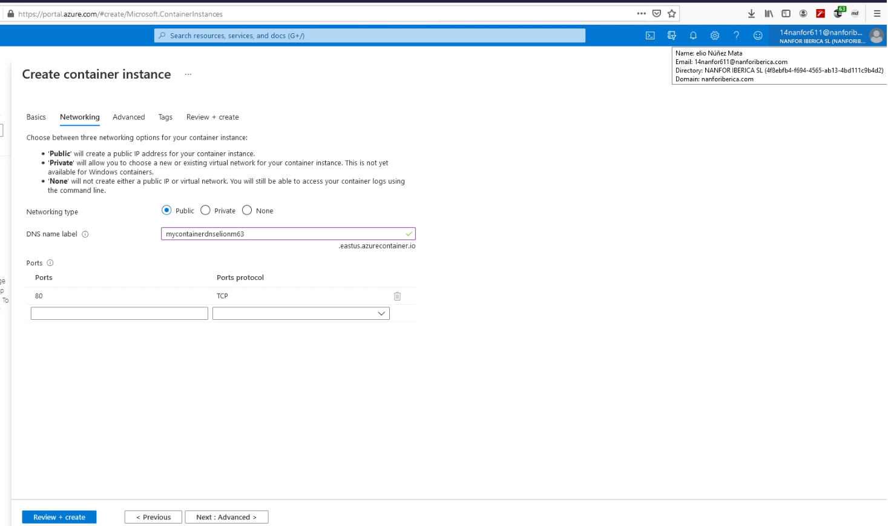
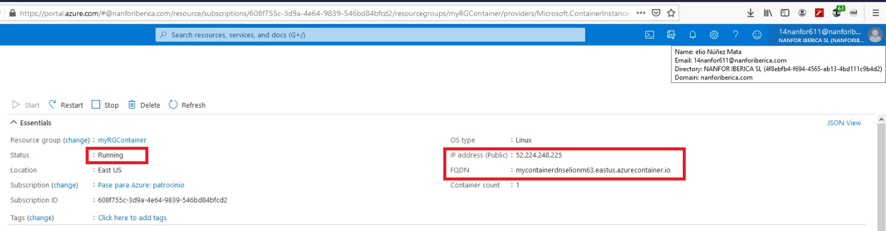
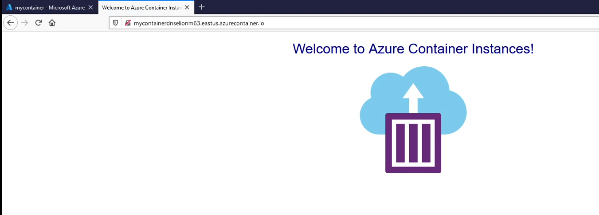
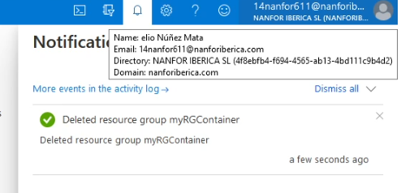

# 01 - Create a virtual machine in the portal

Validating Virtual Machine:

The public IP:

Checking Ports 80 and 3389 are opened:

Connecting by **RDP**:

Installing the web server role:

Default IIS Web Server welcome page:

Deleting used resource group:

# 02 - Create a Web App

Creating the App Service:

App Service Overview:

The Welcome to Azure Container Instances page:

Telemetry charts:

Disposing resource group:

# 03 - Deploy Azure Container Instances

Basic details input:

**Networking** tab:

**Status** and **Fully Qualified Domain Name** (FQDN): 

The Welcome page displayed in the browser:

Removed the resource group:

# 04 - Create a virtual network

 Creating the virtual network:

 Created a virtual machine:

Create a second virtual machine and tested connection between the two virtual machines:

Deployment of resources:

Virtual Network Diagram:

Deleted resource group:

# 05 - Create blob storage

Creating the new storage account:

**Storage accounts**:

Added a Container:

Uploaded some files:

 Storage account **Insights**:

Deleted resource group:

# 06 - Create a SQL database

Creating the SQL database:

Already created database:

Error trying to Log in:

Add the IP address to Firewall settings:

Login again and executing an SQL query:

Deleted resource group:

#  07 - Implement an Azure IoT Hub

Created the IoT Hub:

Added an IoT device to the IoT hub:

Testing the device using the Raspberry Pi Simulator:

**IoT Hub Usage** information:

Deleted resource group:

# 08 - Implement Azure Functions

Created the **Function App**:

Verified **Running** status:

Created a Webhook + API **Function App**:

Auto-generated code and URL:

Requested  without name parameter:

Requested  with name parameter in the URL:

Traces in the Azure portal: 

Deleted resource group:

# 09 - Create a VM with a Template

The Virtual Machine template:

