# 01 - Create a virtual machine in the portal

Validating Virtual Machine:

The public IP:

Checking Ports 80 and 3389 are opened:

Connecting by **RDP**:

Installing the web server role:

Default IIS Web Server welcome page:

Deleting used resource group:

# 02 - Create a Web App

Creating the App Service:

App Service Overview:

The Welcome to Azure Container Instances page:

Telemetry charts:

Disposing resource group:

# 03 - Deploy Azure Container Instances

Basic details input:

**Networking** tab:

**Status** and **Fully Qualified Domain Name** (FQDN): 

The Welcome page displayed in the browser:

Removed the resource group:

# 04 - Create a virtual network

 Creating the virtual network:

 Created a virtual machine:

Create a second virtual machine and tested connection between the two virtual machines:

Deployment of resources:

Virtual Network Diagram:

Deleted resource group:

# 05 - Create blob storage

Creating the new storage account:

**Storage accounts**:

Added a Container:

Uploaded some files:

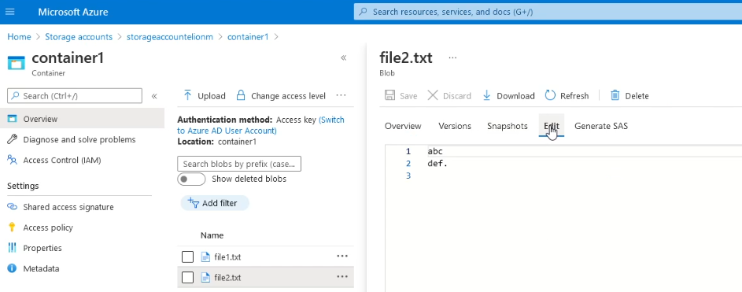

 Storage account **Insights**:

Deleted resource group:

# 06 - Create a SQL database

Creating the SQL database:

Already created database:

Error trying to Log in:

Add the IP address to Firewall settings:

Login again and executing an SQL query:

Deleted resource group:

#  07 - Implement an Azure IoT Hub

Created the IoT Hub:

Added an IoT device to the IoT hub:

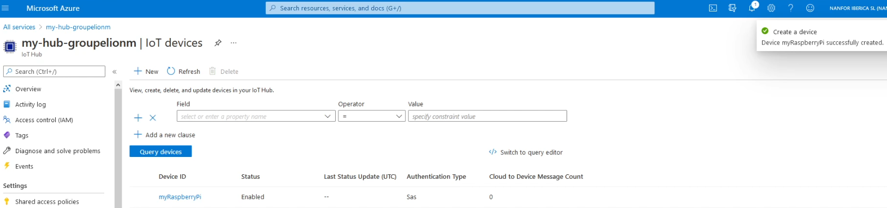

Testing the device using the Raspberry Pi Simulator:

**IoT Hub Usage** information:

Deleted resource group:

# 08 - Implement Azure Functions

Created the **Function App**:

Verified **Running** status:

Created a Webhook + API **Function App**:

Auto-generated code and URL:

Requested  without name parameter:

Requested  with name parameter in the URL:

Traces in the Azure portal: 

Deleted resource group:

# 09 - Create a VM with a Template

The Virtual Machine template:

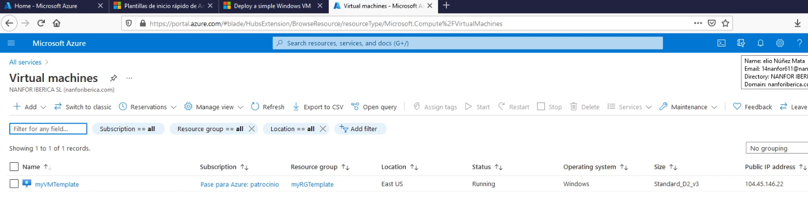

Deleted resource group:

# 10 - Create a VM with PowerShell

  Created a new resource group:

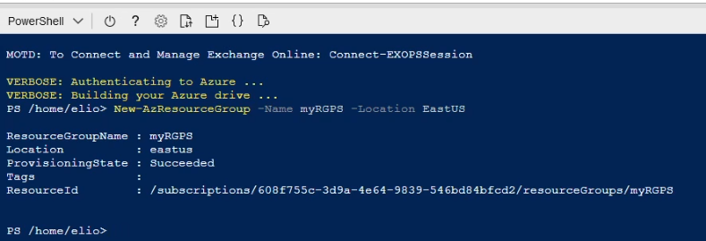

Verifying your new resource group:

Creating a virtual machine:

Verify the virtual machine is running:

Retrieving information about the virtual machine:

Stop the virtual machine:

Verifying the virtual machine state:

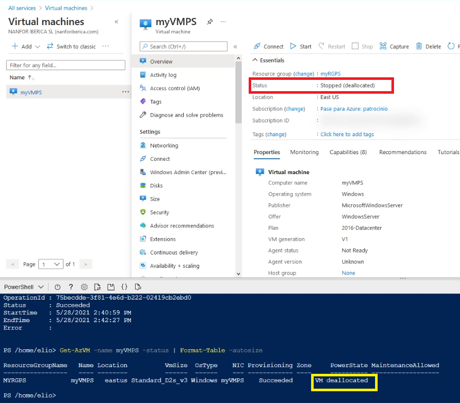

Deleted resource group:

# 11 - Create a VM with the CLI

Create a new resource group:

Verify the resource group was created:

 

Create a new virtual machine:

Verify that the virtual machine is running:

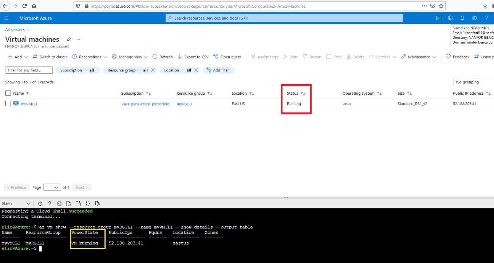

Stop the virtual machine.

Deleted resource group:

# 12 - Implement Azure Key Vault

Created Key vault:

 

Create a password secret:

Deleted resource group:

# 13 - Secure network traffic

Create a Windows Server 2019 Datacenter virtual machine:

Create a network security group:

Associated network security group with the network interface:

Attempt to connect to the virtual machine  using default settings of network security group:

 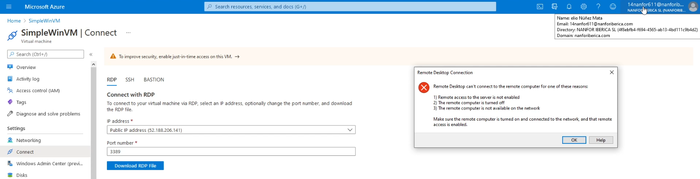

Configuring network security group to allow RDP:

Trying again to RDP into the virtual machine:

Created a NSG outbound port rule to deny Internet access:

Deleted resource group:

# 14 - Manage access with RBAC

Created a resource group and assigned a role:

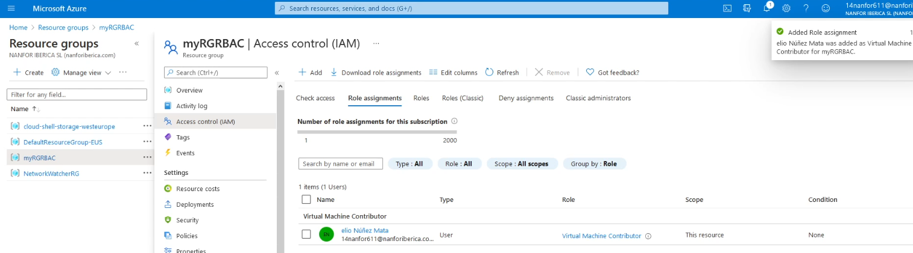

Verify the Activity log:

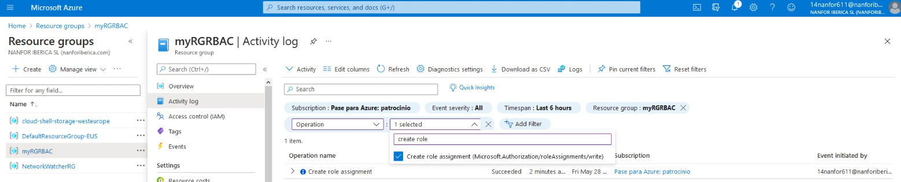

Removing the role assignment:

Deleted resource group:

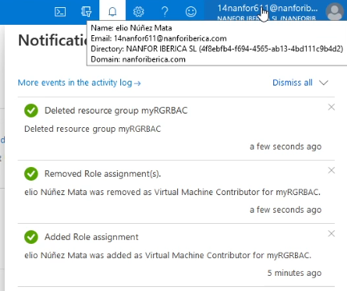

# 15 - Manage resource locks

Created a resource group and configured a lock:

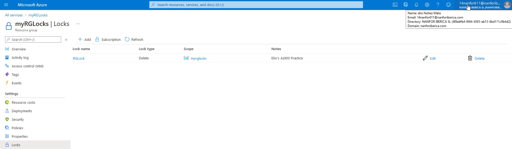

Test deleting the resource group:

Created  storage accounts and test deleting it:

Removed the resource lock, deleted storage accounts and resource group:

#  16 - Implement resource tagging

Assigning a policy: 

Create storage accounts without the Company tag to test the required tagging:

The storage accounts created with the Company tag in the tags blade:

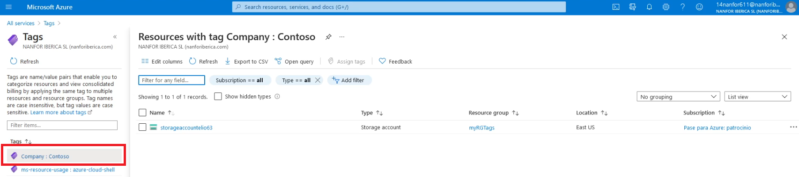

Filter resources by tag:

Deleted policy assignment:

Removed the resource group:

# 17 - Create an Azure Policy

Assigning a location policy for Japan West only:

Test the Allowed location policy creating a resource:

Deleted the policy assignment:

Created another storage account to ensure the policy is no longer in effect:

Removed the resource group:

# 18 - Explore the Trust Center

Microsoft Trust Center compliance offerings page:

 **ISO 27001**:

Service Trust Portal (STP) page:

Compliance Manager Guides:

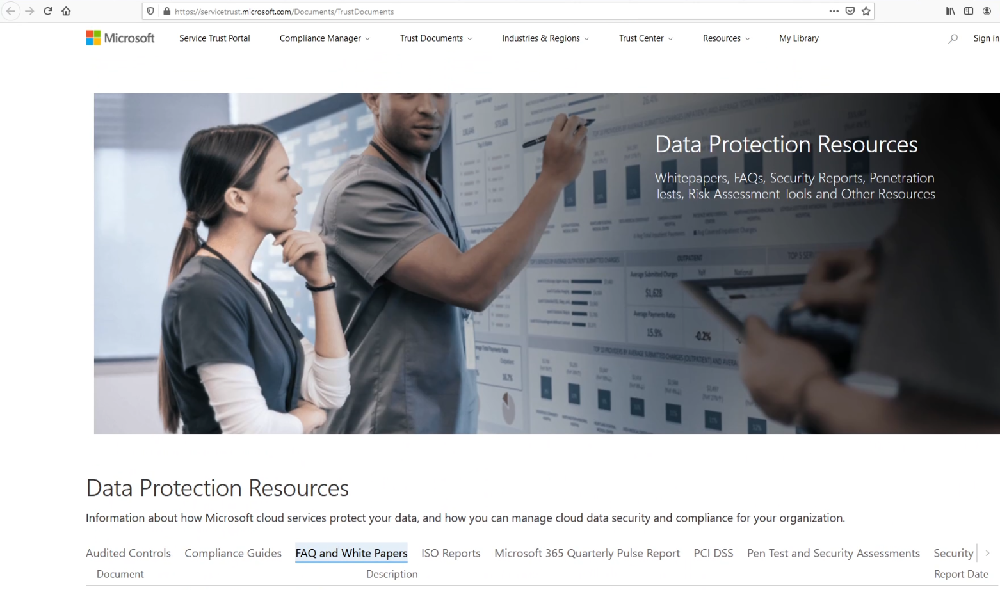

# 19 - Use the Pricing Calculator

# 20 - Use the Azure TCO Calculator

#  21 - Calculate Composite SLAs

# 22 - Open a Support Request

